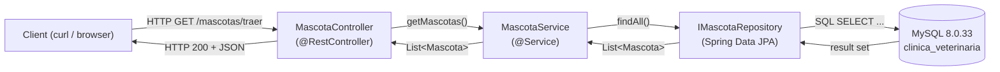
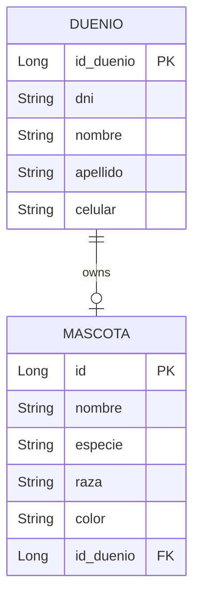
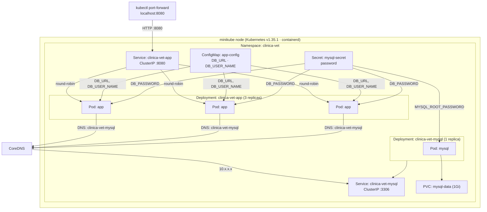
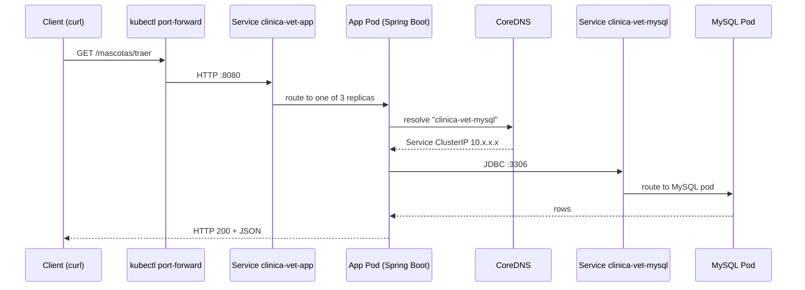

# Clinica Veterinaria

REST API for a veterinary clinic built with **Spring Boot 3.2.4** (Java 17) and **MySQL 8.0.33**, deployed to **Kubernetes** (minikube).

- Manages **owners** (dueños) and **pets** (mascotas)
- Exposes a REST API on port `8080`
- Runs on a local Kubernetes cluster (minikube + podman) with declarative manifests in [`k8s/`](k8s/)

---

## Tech Stack

| Layer | Technology |
|---|---|
| Language / Framework | Java 17 · Spring Boot 3.2.4 (spring-boot-starter-web, data-jpa) |
| ORM | Spring Data JPA (Hibernate, MySQL dialect) |
| Database | MySQL 8.0.33 |
| Build | Maven (`mvnw` wrapper) |
| Container runtime | Podman / Docker (Dockerfile provided) |
| Orchestration | Kubernetes v1.35.1 (minikube, containerd runtime) |
| Other | Lombok, JUnit/Mockito (unit tests) |

---

## Project Structure

```
.
├── docker-compose.yml          # Local run (app + MySQL)
├── k8s/                        # Kubernetes manifests
│   ├── 00-namespace.yaml       # Namespace: clinica-vet
│   ├── 01-mysql-secret.yaml    # Secret: MySQL password
│   ├── 02-mysql-pvc.yaml       # PVC: 1Gi persistent disk
│   ├── 03-mysql-deployment.yaml# Deployment: MySQL + probes
│   ├── 04-mysql-service.yaml   # Service: clinica-vet-mysql
│   ├── 05-app-configmap.yaml   # ConfigMap: DB URL, DB user
│   ├── 06-app-deployment.yaml  # Deployment: app (3 replicas) + probes
│   └── 07-app-service.yaml     # Service: clinica-vet-app
└── clinica_veterinaria/        # Spring Boot application
    ├── Dockerfile
    ├── pom.xml
    └── src/main/java/com/todocodeacademy/clinica_veterinaria/
        ├── controller/         # REST controllers (HTTP layer)
        ├── service/            # Business logic
        ├── repository/         # Spring Data JPA repositories
        ├── model/              # JPA entities: Duenio, Mascota
        └── dto/                # MascoDuenioDTO (join projection)
```

---

## Application Architecture

The app follows the classic Spring Boot **layered architecture**:

**Controller → Service → Repository → Database**



### Data Model

`Duenio` and `Mascota` are JPA entities. A pet belongs to exactly one owner (`@OneToOne`).



### API Endpoints

| Method | Path | Description |
|---|---|---|
| GET | `/duenio/traer` | List all owners |
| POST | `/duenio/crear` | Create an owner |
| PUT | `/duenio/editar` | Update an owner |
| DELETE | `/duenio/borrar/{id}` | Delete an owner |
| GET | `/mascotas/traer` | List all pets |
| POST | `/mascotas/crear` | Create a pet |
| PUT | `/mascotas/editar` | Update a pet |
| DELETE | `/mascotas/borrar/{id_mascota}` | Delete a pet |
| GET | `/mascotas/traer-caniches` | List poodle dogs (`especie=perro` and `raza=caniche`) |
| GET | `/mascotas/traer-duenios` | Pets with their owner (via `MascoDuenioDTO`) |

### Configuration

`src/main/resources/application.properties` reads everything from environment variables, which is what makes the app environment-agnostic (Docker Compose or Kubernetes):

```
DB_URL          → spring.datasource.url
DB_USER_NAME    → spring.datasource.username
DB_PASSWORD     → spring.datasource.password
server.port     = 8080
spring.jpa.hibernate.ddl-auto = update
```

---

## Kubernetes Architecture

Everything lives in its own **namespace `clinica-vet`**. The app pods reach MySQL **only by service name** (`clinica-vet-mysql`), resolved by CoreDNS — pods never know the MySQL pod's IP.



### Resource Inventory

| Manifest | Kind | Role |
|---|---|---|
| `00-namespace.yaml` | Namespace | Logical isolation for the whole stack |
| `01-mysql-secret.yaml` | Secret | MySQL password (injected as env var) |
| `02-mysql-pvc.yaml` | PersistentVolumeClaim | 1Gi disk, survives pod restarts (self-healing keeps data) |
| `03-mysql-deployment.yaml` | Deployment | 1 MySQL replica + readiness/liveness probes |
| `04-mysql-service.yaml` | Service (ClusterIP) | Stable DNS name `clinica-vet-mysql:3306` |
| `05-app-configmap.yaml` | ConfigMap | Non-sensitive config (DB URL, user) |
| `06-app-deployment.yaml` | Deployment | 3 app replicas, env from ConfigMap+Secret, HTTP probes |
| `07-app-service.yaml` | Service (ClusterIP) | Load-balances `clinica-vet-app:8080` across app pods |

### Request Path (end to end)



### Key Kubernetes Concepts in Action

- **Self-healing** — delete a pod and the Deployment recreates it automatically (desired state reconciliation).
- **Persistence** — MySQL data lives in the PVC; deleting the pod does not lose data.
- **Service discovery** — the app connects to `clinica-vet-mysql`, a stable DNS name backed by CoreDNS, never to pod IPs.
- **Load balancing** — the app Service round-robins across all ready replicas.
- **Probes** — `readinessProbe` gates traffic until the app can answer a real DB-backed request; `livenessProbe` restarts a hung pod.
- **Rolling updates** — changing the Deployment creates a new ReplicaSet and migrates pods without downtime.

---

## Running Locally with Docker Compose

```bash
docker compose up --build
# app → http://localhost:8080  ·  MySQL → localhost:3307
```

---

## Running on Kubernetes (minikube)

### Prerequisites

- [minikube](https://minikube.sigs.k8s.io/docs/) + `kubectl`
- Podman (or Docker) as the container runtime

### 1. Start the cluster

```bash
minikube start --driver=podman --container-runtime=containerd
```

### 2. Build the app image and load it into the node

The Dockerfile copies the jar from `clinica_veterinaria/target/`, so build it first if missing:

```bash
cd clinica_veterinaria && ./mvnw clean package && cd ..
```

Build the image, export it to a tar and load it into minikube:

```bash
podman build -t clinica-vet-app:latest clinica_veterinaria/
podman save -o /tmp/clinica-vet-app.tar clinica-vet-app:latest
minikube image load /tmp/clinica-vet-app.tar
```

> **Note:** with the podman driver, load the image **as a tar file**. Loading by image name (`minikube image load clinica-vet-app:latest`) fails because minikube looks for a local Docker daemon. The image lands in the node as `localhost/clinica-vet-app:latest`, which is the exact name the Deployment uses with `imagePullPolicy: IfNotPresent`.

### 3. Apply the manifests

```bash
kubectl apply -f k8s/
kubectl get pods -n clinica-vet -w     # wait until all show 1/1 Running
```

### 4. Test the API

```bash
kubectl port-forward -n clinica-vet svc/clinica-vet-app 8080:8080
```

In another terminal:

```bash
curl http://localhost:8080/duenio/traer                                        # list owners
curl -X POST http://localhost:8080/duenio/crear \
  -H 'Content-Type: application/json' \
  -d '{"dni":"30123456","nombre":"Juan","apellido":"Perez","celular":"1155551234"}'
curl http://localhost:8080/mascotas/traer                                       # list pets
```

---

## Useful kubectl Commands

```bash
kubectl get nodes                                    # cluster nodes
kubectl get pods,deploy,svc,pvc -n clinica-vet      # everything at a glance
kubectl get endpoints clinica-vet-app -n clinica-vet # which pods the Service routes to
kubectl logs deploy/clinica-vet-app -n clinica-vet   # app logs
kubectl describe pod <pod> -n clinica-vet            # events, probes, env, IPs
kubectl scale deployment clinica-vet-app --replicas=3 -n clinica-vet   # scale up/down
kubectl rollout status deployment/clinica-vet-app -n clinica-vet       # watch a rollout
kubectl rollout history deployment/clinica-vet-app -n clinica-vet      # rollout revisions
```

## Cleanup

```bash
kubectl delete ns clinica-vet      # remove the whole stack (namespace + resources)
minikube stop                      # pause the cluster
minikube delete                    # destroy the cluster (requires reloading the image)
```
